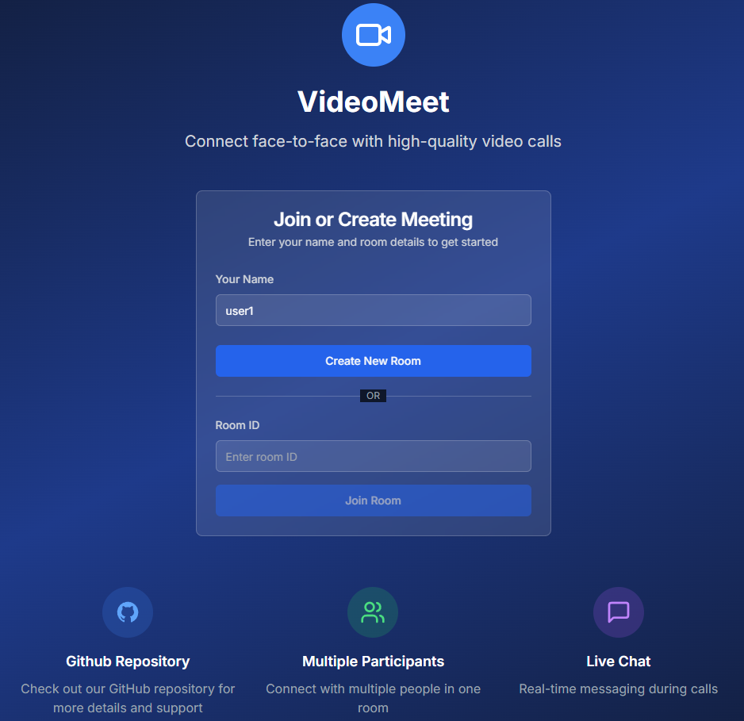
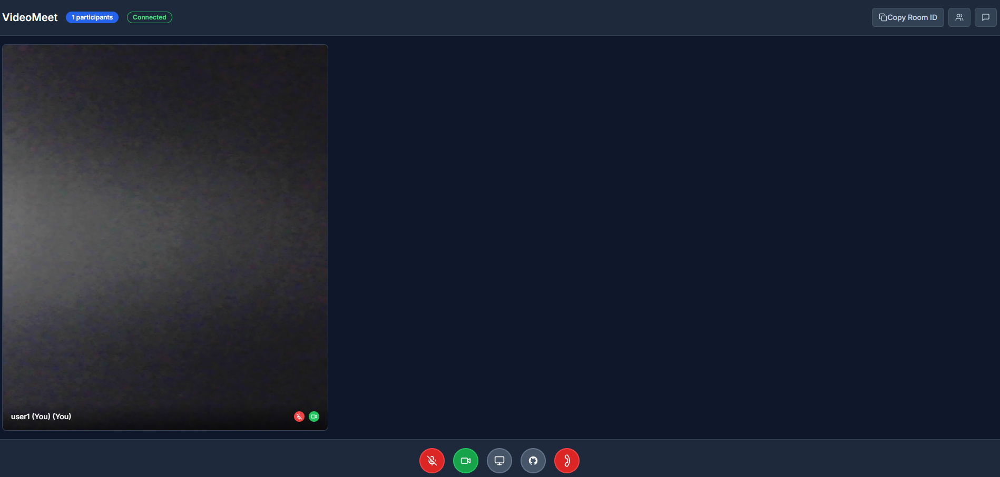
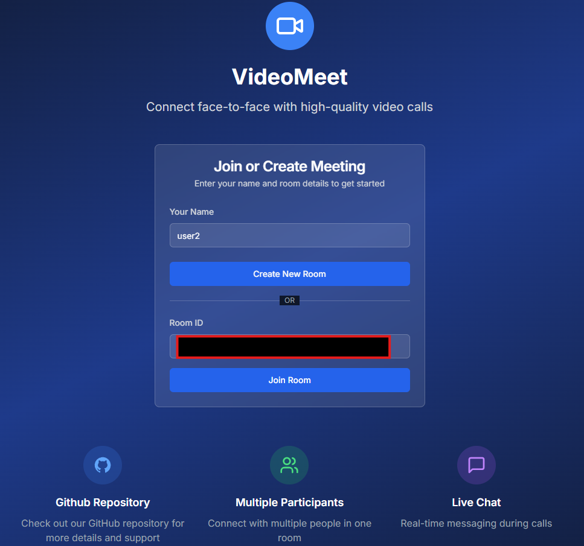
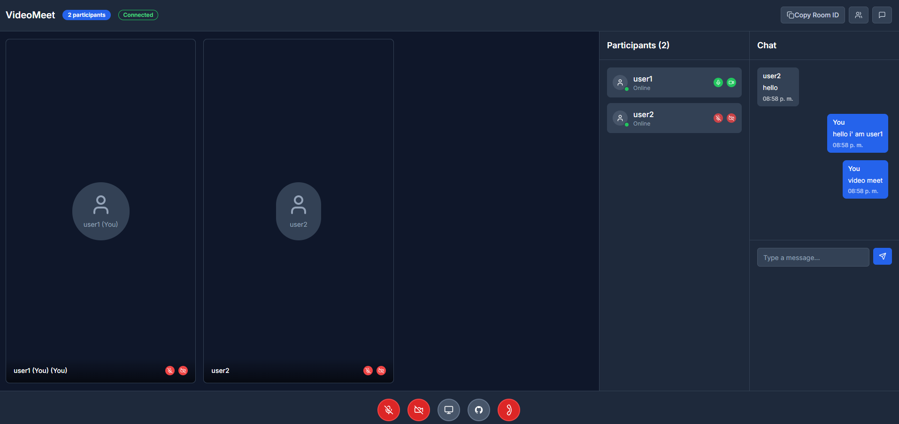
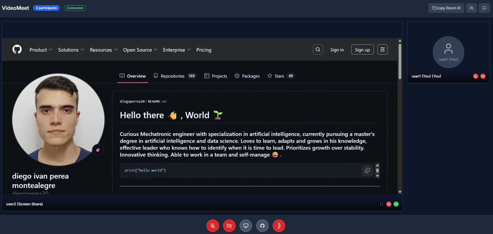

# 🎥 VideoMeet


**VideoMeet** is a modern web videoconferencing application built with **Next.js 13**, **Socket.IO** and **WebRTC**. It allows users to create meeting rooms, join them, and enjoy high-quality video calls with advanced features like screen sharing and real-time chat.


<p align="center">
  
</p>

<br>
<br>
<br>
<br>

-----

<p align="center">
  
</p>

<p align="center">
  
</p>

<p align="center">
  
</p>


<p align="center">
  
</p>

<p align="center">
  
</p>


## ✨ Key Features

### 🎯 Videoconferencing Functionality

- **Multiplayer video calls** with HD quality
- **Bidirectional audio** with individual controls
- **Screen sharing** with optimized view for presentations
- **Private rooms** with automatically generated unique IDs
- **Adaptive interface** that automatically adjusts to the number of participants

### 💬 Chat and Communication

- **Real-time chat** during videoconferences
- **Unread message counter** with visual notifications
- **Participants panel** with real-time status
- **Status indicators** (microphone, camera, connection)

### 🎨 User Interface

- **Modern design** with Tailwind CSS and shadcn/ui components
- **Elegant and professional dark mode**
- **Responsive design** for desktop and mobile
- **Smooth animations** and fluid transitions
- **Intuitive controls** with Lucide React icons

### 🔧 Technical Features

- **WebRTC** for low-latency peer-to-peer communication
- **Socket.IO** for real-time signaling and synchronization
- **TypeScript** for greater robustness and better development experience
- **Next.js 13** with App Router for optimized performance

## 🚀 Installation and Setup

### Prerequisites

Make sure you have installed on your system:

- **Node.js** (version 18.0.0 or higher)
- **npm** or **yarn**

### 1. Clone the Repository

```bash
git clone https://github.com/your-username/videomeet.git
cd videomeet
```

### 2. Install Dependencies

```bash
npm install
# or
yarn install
```

### 4. Run in Development Mode

```bash
npm run dev
# or
yarn dev
```

This will simultaneously start:

- **Next.js Client** at `http://localhost:3000`
- **Socket.IO Server** at `http://localhost:4001`

### 5. Build for Production

```bash
npm run build
npm start
# or
yarn build
yarn start
```

## 📖 Application Usage

### Create a New Meeting

1. **Access** the main page at `http://localhost:3000`
2. **Enter your name** in the corresponding field
3. **Click** on "Create New Room"
4. **Share** the generated room ID with other participants

### Join an Existing Meeting

1. **Get** the room ID from the organizer
2. **Enter your name** and the **room ID**
3. **Click** on "Join Room"
4. **Allow** access to camera and microphone when requested

### Meeting Controls

| Control | Function     | Description               |
| ------- | ------------ | ------------------------- |
| 🎤      | Microphone   | Turn audio on/off         |
| 📹      | Camera       | Turn video on/off         |
| 🖥️      | Screen       | Start/stop screen sharing |
| 💬      | Chat         | Open/close chat panel     |
| 👥      | Participants | View participants list    |
| 📋      | Copy ID      | Copy room ID to clipboard |
| ☎️      | End Call     | Leave the meeting         |

### Technologies Used

#### Frontend

- **Next.js 13** - React framework with App Router
- **TypeScript** - Typed superset of JavaScript
- **Tailwind CSS** - Utility-first CSS framework
- **shadcn/ui** - UI component library
- **Lucide React** - Modern and consistent icons
- **Sonner** - Elegant notification system

#### Backend

- **Socket.IO** - Real-time bidirectional communication
- **Express.js** - Minimalist web server
- **CORS** - Cross-origin resource sharing handling

#### WebRTC and Media

- **WebRTC** - Native browser peer-to-peer communication
- **Media Capture API** - Camera and microphone access
- **Screen Capture API** - Screen sharing functionality

## 🤝 Contributing

Contributions are welcome! Please:

1. **Fork** the repository
2. **Create** a feature branch (`git checkout -b feature/new-feature`)
3. **Commit** your changes (`git commit -m 'Add new feature'`)
4. **Push** to the branch (`git push origin feature/new-feature`)
5. **Open** a Pull Request

### Report Bugs

Use GitHub's Issue system to report problems, including:

- **Detailed description** of the problem
- **Steps to reproduce** the error
- **Screenshots** if relevant
- **Browser and operating system** information

## 📄 License

This project is under the **MIT** license. Check the `LICENSE` file for more details.

## 👨‍💻 Author

- GitHub: [@diegoperea20](https://github.com/diegoperea20)


## 🙏 Acknowledgments

- **Vercel** for Next.js and their deployment platform
- **Socket.IO** for the excellent real-time library
- **shadcn/ui** for the elegant UI components
- **Tailwind CSS** for the efficient CSS framework
- **Lucide** for the consistent and modern icons

---

**⭐ If this project was useful to you, don't forget to give it a star on GitHub!**


## 🔒 Security Considerations

- **HTTPS required** for media functions in production
- **Input validation** in chat messages
- **Room limits** to prevent overload
- **Authentication tokens** recommended for production


----

Created by [Diego Ivan Perea Montealegre](https://github.com/diegoperea20)